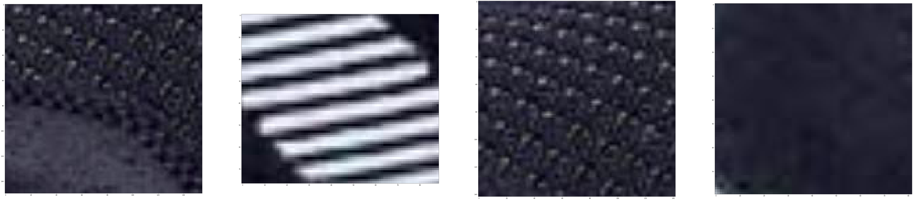
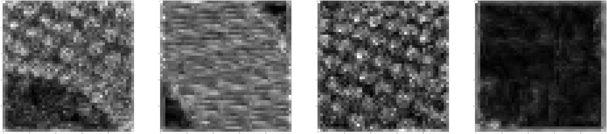
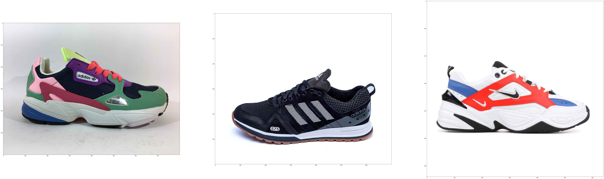
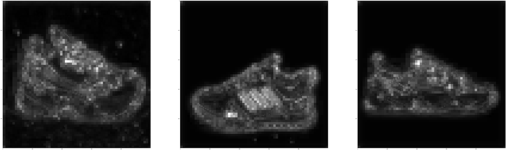
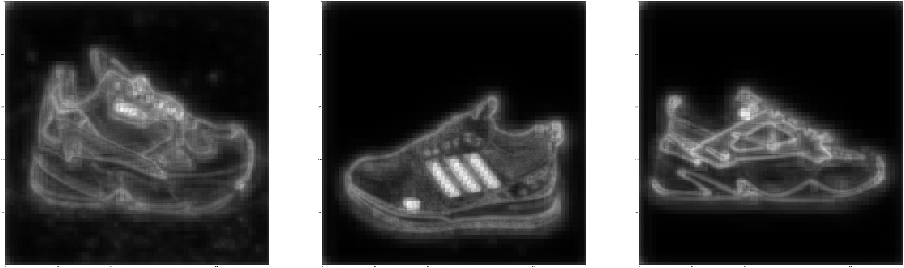
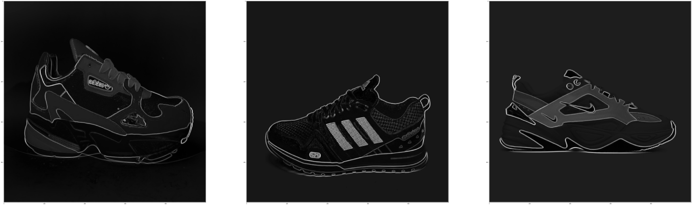
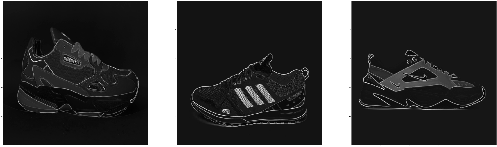
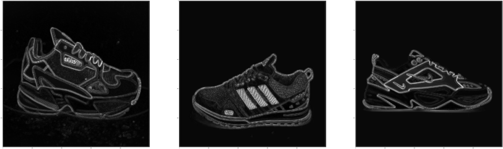
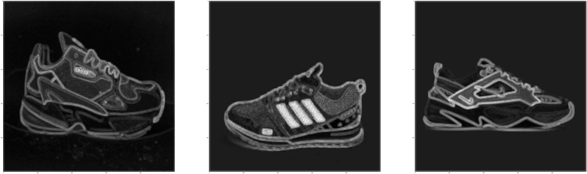

# Textures

-----

#### The pretrained convolutional network (VGG 19) is used to get texture.
#### For getting the Style Features  are used layers from the list (conv1_1, conv2_1, conv3_1, conv4_1, conv5_1) based on [original paper](https://www.cv-foundation.org/openaccess/content_cvpr_2016/papers/Gatys_Image_Style_Transfer_CVPR_2016_paper.pdf). 

-----

## Below is an example of the results for full images and patches

#### Origin patches:

-----

#### Using two first layers for patches

-----

#### Origin images:

-----

#### Using all layers

*Merger tensor by maximum values*

*Merger tensor by mean*

-----

#### Using first layer

*Merger tensor by maximum values*

*Merger tensor by mean*

-----

#### Using two first layers

*Merger tensor by maximum values*

*Merger tensor by mean*

-----

## TODO:
- *add padding to rectangular images*
- *etс*

